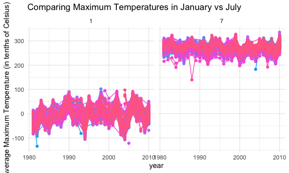
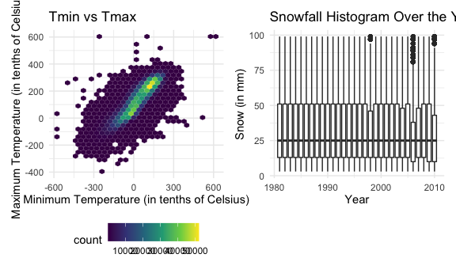

asn2139\_p8105\_hw3
================
Akanksha Nalatwad

``` r
library(tidyverse)
```

    ## ── Attaching packages ──────────────────────────────────────────────────────────────────────────────────────────────── tidyverse 1.3.0 ──

    ## ✓ ggplot2 3.3.2     ✓ purrr   0.3.4
    ## ✓ tibble  3.0.3     ✓ dplyr   1.0.2
    ## ✓ tidyr   1.1.2     ✓ stringr 1.4.0
    ## ✓ readr   1.4.0     ✓ forcats 0.5.0

    ## ── Conflicts ─────────────────────────────────────────────────────────────────────────────────────────────────── tidyverse_conflicts() ──
    ## x dplyr::filter() masks stats::filter()
    ## x dplyr::lag()    masks stats::lag()

``` r
library(ggplot2)
library(ggridges)
library(patchwork)

knitr::opts_chunk$set(
  fig.width=6,
  fig.asp= .6,
  out.width= "90%"
)
theme_set(theme_minimal()+theme(legend.position="bottom"))

options(
  ggplot2.continuous.color="viridis",
  ggplot2.continuous.fill= "viridis"
)

scale_color_discrete= scale_color_viridis_d
scale_fill_discrete= scale_color_viridis_d
```

``` r
devtools::install_github("p8105/p8105.datasets") 
```

    ## Skipping install of 'p8105.datasets' from a github remote, the SHA1 (412759e3) has not changed since last install.
    ##   Use `force = TRUE` to force installation

``` r
library(p8105.datasets)
data("instacart")
```

How many aisles, and which are most items from?

``` r
instacart %>% 
  count(aisle) %>% 
  arrange(desc(n))
```

    ## # A tibble: 134 x 2
    ##    aisle                              n
    ##    <chr>                          <int>
    ##  1 fresh vegetables              150609
    ##  2 fresh fruits                  150473
    ##  3 packaged vegetables fruits     78493
    ##  4 yogurt                         55240
    ##  5 packaged cheese                41699
    ##  6 water seltzer sparkling water  36617
    ##  7 milk                           32644
    ##  8 chips pretzels                 31269
    ##  9 soy lactosefree                26240
    ## 10 bread                          23635
    ## # … with 124 more rows

Make a plot

``` r
instacart %>% 
  count(aisle) %>% 
  filter(n>10000) %>% 
  mutate(
    aisle=factor(aisle),
    aisle= fct_reorder(aisle,n)
  ) %>% 
  ggplot(aes(x=aisle, y=n))+
  geom_point()+
  theme(axis.text=element_text(angle=90, vjust=0.5, hjust=1))
```


Let’s make a table\!\!

``` r
instacart %>% 
  filter(aisle %in% c("baking ingredients", "dog food care", "packaged vegetable fruits")) %>% 
  group_by(aisle) %>% 
  count(product_name) %>% 
  mutate(rank=min_rank(desc(n))) %>% 
  filter(rank < 4) %>% 
  arrange(aisle,rank) %>% 
  knitr::kable()
```

| aisle              | product\_name                                 |   n | rank |
| :----------------- | :-------------------------------------------- | --: | ---: |
| baking ingredients | Light Brown Sugar                             | 499 |    1 |
| baking ingredients | Pure Baking Soda                              | 387 |    2 |
| baking ingredients | Cane Sugar                                    | 336 |    3 |
| dog food care      | Snack Sticks Chicken & Rice Recipe Dog Treats |  30 |    1 |
| dog food care      | Organix Chicken & Brown Rice Recipe           |  28 |    2 |
| dog food care      | Small Dog Biscuits                            |  26 |    3 |

Apples vs ice cream

``` r
instacart %>% 
  filter(product_name %in% c("Pink Lady Apples", "Coffee Ice Cream")) %>% 
  group_by(product_name, order_dow) %>% 
  summarize(mean_hour=mean(order_hour_of_day)) %>% 
  pivot_wider(
    names_from= order_dow,
    values_from=mean_hour
  )
```

    ## `summarise()` regrouping output by 'product_name' (override with `.groups` argument)

    ## # A tibble: 2 x 8
    ## # Groups:   product_name [2]
    ##   product_name       `0`   `1`   `2`   `3`   `4`   `5`   `6`
    ##   <chr>            <dbl> <dbl> <dbl> <dbl> <dbl> <dbl> <dbl>
    ## 1 Coffee Ice Cream  13.8  14.3  15.4  15.3  15.2  12.3  13.8
    ## 2 Pink Lady Apples  13.4  11.4  11.7  14.2  11.6  12.8  11.9

## Problem 2

\#Part 1: Loading and Tidying the Dataset

``` r
accel_df=
  read_csv("./data/accel_data.csv") %>% 
  janitor::clean_names() %>% 
  pivot_longer(activity_1:activity_1440, 
               names_to="minute",
               names_prefix="activity_",
               values_to= "activity_count") %>%
                mutate(minute=as.numeric(minute)) %>%
                mutate(day2=day) %>% 
                mutate(day_type=recode(day2, "Saturday"="Weekend", "Sunday"="Weekend", "Monday"="Weekday",
                                       "Tuesday"="Weekday", "Wednesday"="Weekday", "Thursday"="Weekday",
                                       "Friday"="Weekday")) %>% 
              relocate(week,day_id,day,day_type) %>% 
          select(-day2)
```

    ## 
    ## ── Column specification ─────────────────────────────────────────────────────────────────────────────────────────────────────────────────
    ## cols(
    ##   .default = col_double(),
    ##   day = col_character()
    ## )
    ## ℹ Use `spec()` for the full column specifications.

Description of Dataset: This dataset follows a 65 year old man’s
activity count over the course of 35 days.This dataset’s rows include
50400 and it’s columns include 6. The median activity count per minute
was 74.

## Part 2: Table of Total Activity Counts Per Day

categorized by type of day and week

``` r
accel_modified_df=
accel_df %>% 
   select(-day_type) %>% 
   group_by(day_id,week,day) %>% 
   summarize(max_activity_per_day=max(activity_count, na.rm=TRUE), 
            mean_activity_per_day=mean(activity_count,na.rm=TRUE),
            sum_activity_per_day=sum(activity_count,na.rm=TRUE)) %>% 
   pivot_wider(names_sort=TRUE,
               names_from=day,
            values_from=sum_activity_per_day) %>% 
  relocate(day_id,week,Sunday, Monday, Tuesday, Wednesday, Thursday, Friday, Saturday, mean_activity_per_day) %>% 
  group_by(week) %>%
    summarise(Sunday= sum(Sunday, na.rm = T),
            Monday= sum(Monday, na.rm = T),
            Tuesday= sum(Tuesday, na.rm = T),
            Wednesday= sum(Wednesday, na.rm = T),
            Thursday= sum(Thursday, na.rm = T),
            Friday= sum(Friday, na.rm = T),
            Saturday=sum(Saturday,na.rm=T))
```

    ## `summarise()` regrouping output by 'day_id', 'week' (override with `.groups` argument)

    ## `summarise()` ungrouping output (override with `.groups` argument)

Apparent Trends: -It looks like the first week the man had less activity
than any other week. -On Saturday, the man seems to be least active
since his activity counts were generally lower than on other days. -His
most active days are Friday.

## Single-Panel Plot of 24-hour Activity Time Course

``` r
plot_accel_df=
accel_df %>% 
      mutate(day=forcats::fct_relevel(day,c("Sunday", "Monday", "Tuesday", "Wednesday", "Thursday", "Friday", "Saturday"))) %>% 
      ggplot(aes(x=minute, y=activity_count,color=day))+
      geom_line()+ labs(title="24-Hour Activity Time Course", y="Activity count", x="Minute of Day")

ggsave("plot_accel_df.pdf", plot_accel_df, width=10, height=5)
```

It looks like the man starts becoming active around 6am and continues
being active until he goes to sleep. His highest activiy counts occurs
around 10am, 5pm, and 8pm.Generally, Sundays are generally less active
days excpet around 5pm. Generally his most active days are Tuesdays.

## Problem 3

Before doing a data clean, this dataset is extremely large and bulky. It
has over 5,000,000 values that follow the snowfall (mm), the depth of
snow (mm), precepitation (tenths of mm), minimum temperature (in tenths
of Celsius), maximum temperature(in tenths of Celsius) at different
weather stations identified by id up to year 2010.There are hundreds of
thousands of missing values since the weather stations are from all over
the world and might not experience precipitation, or if the weather
station was not able to gather data that day due to extenuating
circumstances.

\#\#Part 1: Cleaning Datset and Finding Most Common Snowfall Values

``` r
library(p8105.datasets)
data("ny_noaa")

ny_noaa_df=
ny_noaa %>% 
   janitor::clean_names() %>% 
  separate(date, c("year", "month", "day"), sep="-",convert=TRUE) %>% 
  mutate(prcp=as.numeric(prcp)) %>% 
  mutate(tmax= as.numeric(tmax)) %>% 
  mutate(tmin= as.numeric(tmin))

snow_df=
  ny_noaa_df %>% 
  group_by(snow) %>% 
  count() %>% 
  arrange(desc(n))
```

The most common counts of snowfall include 0 which makes sense since a
lot of these weather stations might not be in areas that have either no
or seasonal snowfall. The next most common count was NA, meaning those
values were missing. The third most common counts of snowfall include 25
which might be an indication of some kind of cutoff that might exist
when measuring/observing snowfall.

## Two-Panel Plot

``` r
library(ggplot2)
  ny_noaa_df %>% 
  filter(month %in% c("1","7")) %>% 
  group_by(id, year, month) %>%  
  summarize(avg_tmax=mean(tmax,na.rm=TRUE)) %>% 
  ggplot(aes(x=year, y=avg_tmax, group=id,color=id))+
  geom_point() +
geom_path() +
facet_grid(~ month)+
theme(legend.position = "none")+ labs(title="Comparing Maximum Temperatures in January vs July",
                                      y="Average Maximum Temperature (in tenths of Celsius)")
```

    ## `summarise()` regrouping output by 'id', 'year' (override with `.groups` argument)

    ## Warning: Removed 5970 rows containing missing values (geom_point).

    ## Warning: Removed 5931 row(s) containing missing values (geom_path).



It makes sense that generally temperatures are higher during January
than July. But in January it looks like the January temperatures over
the years follow similar trend lines with a few outliers in 2005. In
July, it looks like the July temperatures over the years follow similar
trendlines with outliers in 1987, 2004, and 2010. This plot is extremely
hard to intrepret since there are so many plot lines on top of each
other. It would be better in the future to be able to see fewer id
stations at a time.

\#\#Two-Panel PLot

``` r
library(patchwork)
library(tidyverse)

tmax_tmin_p=
  ny_noaa_df %>% 
  ggplot(aes(x=tmin, y=tmax))+
  geom_hex()+ labs(title="Tmin vs Tmax", 
                   x="Minimum Temperature (in tenths of Celsius)",
                   x="Minimum Temperature (in tenths of Celsius)")
  

snowfall_p=
 ny_noaa %>% 
   janitor::clean_names() %>% 
  separate(date, c("year", "month", "day"), sep="-",convert=TRUE) %>% 
  filter(snow %in% c(1:100)) %>% 
  ggplot(aes(x=year, y=snow,group=year))+
  geom_boxplot()+ labs(title="Snowfall Histogram Over the Years", 
                       x="Year",
                       y="Snow (in mm)")

tmax_tmin_p+snowfall_p
```

    ## Warning: Removed 1136276 rows containing non-finite values (stat_binhex).


