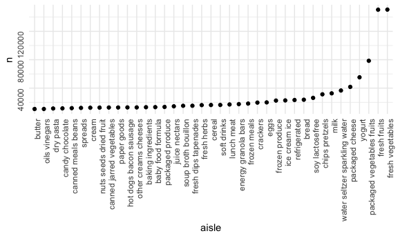

asn2139\_p8105\_hw3
================
Akanksha Nalatwad

``` r
library(tidyverse)
```

    ## ── Attaching packages ───────────────────────────────────────────────────────────────────────────────────────────────── tidyverse 1.3.0 ──

    ## ✓ ggplot2 3.3.2     ✓ purrr   0.3.4
    ## ✓ tibble  3.0.3     ✓ dplyr   1.0.2
    ## ✓ tidyr   1.1.2     ✓ stringr 1.4.0
    ## ✓ readr   1.3.1     ✓ forcats 0.5.0

    ## ── Conflicts ──────────────────────────────────────────────────────────────────────────────────────────────────── tidyverse_conflicts() ──
    ## x dplyr::filter() masks stats::filter()
    ## x dplyr::lag()    masks stats::lag()

``` r
knitr::opts_chunk$set(
  fig.width=6,
  fig.asp= .6,
  out.width= "90%"
)
theme_set(theme_minimal()+theme(legend.position="bottom"))

options(
  ggplot2.continuous.color="viridis",
  ggplot2.continuous.fill= "viridis"
)

scale_color_discrete= scale_color_viridis_d
scale_fill_discrete= scale_color_viridis_d
```

``` r
devtools::install_github("p8105/p8105.datasets") 
```

    ## Skipping install of 'p8105.datasets' from a github remote, the SHA1 (412759e3) has not changed since last install.
    ##   Use `force = TRUE` to force installation

``` r
library(p8105.datasets)
data("instacart")
```

How many aisles, and which are most items from?

``` r
instacart %>% 
  count(aisle) %>% 
  arrange(desc(n))
```

    ## # A tibble: 134 x 2
    ##    aisle                              n
    ##    <chr>                          <int>
    ##  1 fresh vegetables              150609
    ##  2 fresh fruits                  150473
    ##  3 packaged vegetables fruits     78493
    ##  4 yogurt                         55240
    ##  5 packaged cheese                41699
    ##  6 water seltzer sparkling water  36617
    ##  7 milk                           32644
    ##  8 chips pretzels                 31269
    ##  9 soy lactosefree                26240
    ## 10 bread                          23635
    ## # … with 124 more rows

Make a plot

``` r
instacart %>% 
  count(aisle) %>% 
  filter(n>10000) %>% 
  mutate(
    aisle=factor(aisle),
    aisle= fct_reorder(aisle,n)
  ) %>% 
  ggplot(aes(x=aisle, y=n))+
  geom_point()+
  theme(axis.text=element_text(angle=90, vjust=0.5, hjust=1))
```



Let’s make a table\!\!

``` r
instacart %>% 
  filter(aisle %in% c("baking ingredients", "dog food care", "packaged vegetable fruits")) %>% 
  group_by(aisle) %>% 
  count(product_name) %>% 
  mutate(rank=min_rank(desc(n))) %>% 
  filter(rank < 4) %>% 
  arrange(aisle,rank) %>% 
  knitr::kable()
```

| aisle              | product\_name                                 |   n | rank |
| :----------------- | :-------------------------------------------- | --: | ---: |
| baking ingredients | Light Brown Sugar                             | 499 |    1 |
| baking ingredients | Pure Baking Soda                              | 387 |    2 |
| baking ingredients | Cane Sugar                                    | 336 |    3 |
| dog food care      | Snack Sticks Chicken & Rice Recipe Dog Treats |  30 |    1 |
| dog food care      | Organix Chicken & Brown Rice Recipe           |  28 |    2 |
| dog food care      | Small Dog Biscuits                            |  26 |    3 |

Apples vs ice cream

``` r
instacart %>% 
  filter(product_name %in% c("Pink Lady Apples", "Coffee Ice Cream")) %>% 
  group_by(product_name, order_dow) %>% 
  summarize(mean_hour=mean(order_hour_of_day)) %>% 
  pivot_wider(
    names_from= order_dow,
    values_from=mean_hour
  )
```

    ## `summarise()` regrouping output by 'product_name' (override with `.groups` argument)

    ## # A tibble: 2 x 8
    ## # Groups:   product_name [2]
    ##   product_name       `0`   `1`   `2`   `3`   `4`   `5`   `6`
    ##   <chr>            <dbl> <dbl> <dbl> <dbl> <dbl> <dbl> <dbl>
    ## 1 Coffee Ice Cream  13.8  14.3  15.4  15.3  15.2  12.3  13.8
    ## 2 Pink Lady Apples  13.4  11.4  11.7  14.2  11.6  12.8  11.9
