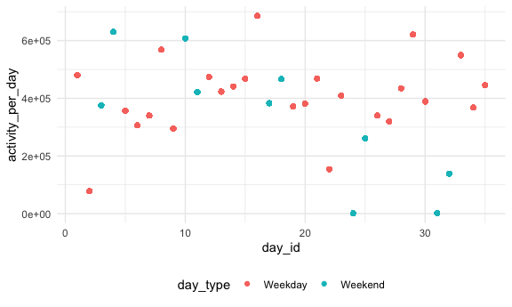

asn2139\_p8105\_hw3
================
Akanksha Nalatwad

``` r
library(tidyverse)
```

    ## ── Attaching packages ─────────────────────────────────────────────────────────────────────────────────────────────────────────────────────────────────── tidyverse 1.3.0 ──

    ## ✓ ggplot2 3.3.2     ✓ purrr   0.3.4
    ## ✓ tibble  3.0.3     ✓ dplyr   1.0.2
    ## ✓ tidyr   1.1.2     ✓ stringr 1.4.0
    ## ✓ readr   1.3.1     ✓ forcats 0.5.0

    ## ── Conflicts ────────────────────────────────────────────────────────────────────────────────────────────────────────────────────────────────────── tidyverse_conflicts() ──
    ## x dplyr::filter() masks stats::filter()
    ## x dplyr::lag()    masks stats::lag()

``` r
knitr::opts_chunk$set(
  fig.width=6,
  fig.asp= .6,
  out.width= "90%"
)
theme_set(theme_minimal()+theme(legend.position="bottom"))

options(
  ggplot2.continuous.color="viridis",
  ggplot2.continuous.fill= "viridis"
)

scale_color_discrete= scale_color_viridis_d
scale_fill_discrete= scale_color_viridis_d
```

``` r
devtools::install_github("p8105/p8105.datasets") 
```

    ## Skipping install of 'p8105.datasets' from a github remote, the SHA1 (412759e3) has not changed since last install.
    ##   Use `force = TRUE` to force installation

``` r
library(p8105.datasets)
data("instacart")
```

How many aisles, and which are most items from?

``` r
instacart %>% 
  count(aisle) %>% 
  arrange(desc(n))
```

    ## # A tibble: 134 x 2
    ##    aisle                              n
    ##    <chr>                          <int>
    ##  1 fresh vegetables              150609
    ##  2 fresh fruits                  150473
    ##  3 packaged vegetables fruits     78493
    ##  4 yogurt                         55240
    ##  5 packaged cheese                41699
    ##  6 water seltzer sparkling water  36617
    ##  7 milk                           32644
    ##  8 chips pretzels                 31269
    ##  9 soy lactosefree                26240
    ## 10 bread                          23635
    ## # … with 124 more rows

Make a plot

``` r
instacart %>% 
  count(aisle) %>% 
  filter(n>10000) %>% 
  mutate(
    aisle=factor(aisle),
    aisle= fct_reorder(aisle,n)
  ) %>% 
  ggplot(aes(x=aisle, y=n))+
  geom_point()+
  theme(axis.text=element_text(angle=90, vjust=0.5, hjust=1))
```


Let’s make a table\!\!

``` r
instacart %>% 
  filter(aisle %in% c("baking ingredients", "dog food care", "packaged vegetable fruits")) %>% 
  group_by(aisle) %>% 
  count(product_name) %>% 
  mutate(rank=min_rank(desc(n))) %>% 
  filter(rank < 4) %>% 
  arrange(aisle,rank) %>% 
  knitr::kable()
```

| aisle              | product\_name                                 |   n | rank |
| :----------------- | :-------------------------------------------- | --: | ---: |
| baking ingredients | Light Brown Sugar                             | 499 |    1 |
| baking ingredients | Pure Baking Soda                              | 387 |    2 |
| baking ingredients | Cane Sugar                                    | 336 |    3 |
| dog food care      | Snack Sticks Chicken & Rice Recipe Dog Treats |  30 |    1 |
| dog food care      | Organix Chicken & Brown Rice Recipe           |  28 |    2 |
| dog food care      | Small Dog Biscuits                            |  26 |    3 |

Apples vs ice cream

``` r
instacart %>% 
  filter(product_name %in% c("Pink Lady Apples", "Coffee Ice Cream")) %>% 
  group_by(product_name, order_dow) %>% 
  summarize(mean_hour=mean(order_hour_of_day)) %>% 
  pivot_wider(
    names_from= order_dow,
    values_from=mean_hour
  )
```

    ## `summarise()` regrouping output by 'product_name' (override with `.groups` argument)

    ## # A tibble: 2 x 8
    ## # Groups:   product_name [2]
    ##   product_name       `0`   `1`   `2`   `3`   `4`   `5`   `6`
    ##   <chr>            <dbl> <dbl> <dbl> <dbl> <dbl> <dbl> <dbl>
    ## 1 Coffee Ice Cream  13.8  14.3  15.4  15.3  15.2  12.3  13.8
    ## 2 Pink Lady Apples  13.4  11.4  11.7  14.2  11.6  12.8  11.9

## Problem 2

Accelerometers have become an appealing alternative to self-report
techniques for studying physical activity in observational studies and
clinical trials, largely because of their relative objectivity. During
observation periods, the devices measure “activity counts” in a short
period; one-minute intervals are common. Because accelerometers can be
worn comfortably and unobtrusively, they produce around-the-clock
observations.

This problem uses five weeks of accelerometer data collected on a 63
year-old male with BMI 25, who was admitted to the Advanced Cardiac Care
Center of Columbia University Medical Center and diagnosed with
congestive heart failure (CHF). The data can be downloaded here. In this
spreadsheet, variables activity.\* are the activity counts for each
minute of a 24-hour day starting at midnight.

Load, tidy, and otherwise wrangle the data. Your final dataset should
include all originally observed variables and values; have useful
variable names; include a weekday vs weekend variable; and encode data
with reasonable variable classes. Describe the resulting dataset
(e.g. what variables exist, how many observations, etc).

``` r
accel_df=
  read_csv("./data/accel_data.csv") %>% 
  janitor::clean_names() %>% 
  pivot_longer(activity_1:activity_1440, 
               names_to="minute",
               names_prefix="activity_",
               values_to= "activity_count") %>%
                mutate(minute=as.numeric(minute)) %>%
                mutate(day2=day) %>% 
                mutate(day_type=recode(day2, "Saturday"="Weekend", "Sunday"="Weekend", "Monday"="Weekday",
                                       "Tuesday"="Weekday", "Wednesday"="Weekday", "Thursday"="Weekday",
                                       "Friday"="Weekday")) %>% 
              relocate(week,day_id,day,day_type) %>% 
          select(-day2)
```

    ## Parsed with column specification:
    ## cols(
    ##   .default = col_double(),
    ##   day = col_character()
    ## )

    ## See spec(...) for full column specifications.

Traditional analyses of accelerometer data focus on the total activity
over the day. Using your tidied dataset, aggregate accross minutes to
create a total activity variable for each day, and create a table
showing these totals. Are any trends apparent?

group by and summarize problem

``` r
accel_modified_df=
accel_df %>% 
   select(-day_type) %>% 
   group_by(day_id,week,day) %>% 
   summarize(max_activity_per_day=max(activity_count, na.rm=TRUE), 
            mean_activity_per_day=mean(activity_count,na.rm=TRUE)) %>% 
   pivot_wider(names_sort=TRUE,
               names_from=day,
            values_from=max_activity_per_day) %>% 
  relocate(day_id,week,Sunday, Monday, Tuesday, Wednesday, Thursday, Friday, Saturday, mean_activity_per_day) %>% 
  group_by(week) %>%
    summarise(Sunday= sum(Sunday, na.rm = T),
            Monday= sum(Monday, na.rm = T),
            Tuesday= sum(Tuesday, na.rm = T),
            Wednesday= sum(Wednesday, na.rm = T),
            Thursday= sum(Thursday, na.rm = T),
            Friday= sum(Friday, na.rm = T),
            Saturday=sum(Saturday,na.rm=T))
```

    ## `summarise()` regrouping output by 'day_id', 'week' (override with `.groups` argument)

    ## `summarise()` ungrouping output (override with `.groups` argument)

Accelerometer data allows the inspection activity over the course of the
day. Make a single-panel plot that shows the 24-hour activity time
courses for each day and use color to indicate day of the week. Describe
in words any patterns or conclusions you can make based on this graph.

``` r
accel_df %>% 
      group_by(day_id,day_type) %>% 
      mutate(activity_per_day=sum(activity_count)) %>% 
      ggplot(aes(x=day_id, y=activity_per_day, color=day_type))+
      geom_point()
```


